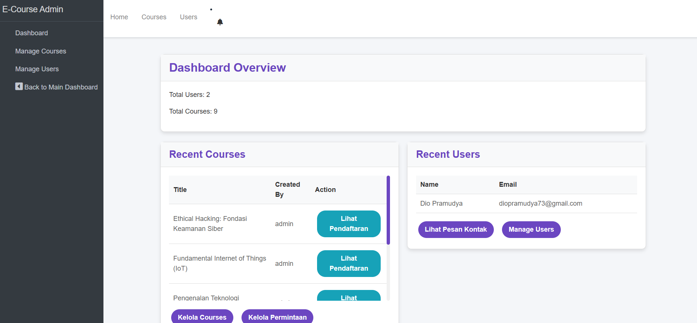

# D-Course - Platform Pembelajaran Online 

D-Course adalah platform pembelajaran online yang dirancang untuk memudahkan pengguna dalam mendaftar dan mengikuti kursus secara daring. Platform ini menyediakan antarmuka yang intuitif untuk pengguna biasa dan administrator, dibangun menggunakan teknologi modern seperti Laravel.

## Fungsi Utama Web

### Untuk Pengguna
- **Melihat Daftar Kursus**: Pengguna dapat melihat daftar kursus yang tersedia di halaman utama.
- **Mengirim Pesan Kontak**: Pengguna dapat mengirim pesan ke admin melalui halaman kontak.
- **Permintaan Pembelian Kursus**: Pengguna dapat mengajukan permintaan pembelian untuk kursus tertentu.

### Untuk Admin
- **Manajemen Kursus**: Admin dapat menambah, mengedit, dan menghapus kursus, termasuk informasi seperti judul, deskripsi, durasi, thumbnail, link tema, dan harga.
- **Manajemen Pengguna**: Admin dapat melihat daftar pengguna dan mengelola data mereka.
- **Manajemen Pesan Kontak**: Admin dapat melihat, membaca detail, dan menghapus pesan yang dikirim oleh pengguna.
- **Manajemen Permintaan Pembelian**: Admin dapat melihat dan mengelola permintaan pembelian kursus dari pengguna.
- **Dashboard Admin**: Admin memiliki dashboard untuk melihat ringkasan data dan navigasi cepat ke fitur manajemen.

## Fitur Utama

### Fitur Pengguna
- **Halaman Kursus**: Menampilkan daftar kursus dalam format kartu yang responsif.
- **Formulir Kontak**: Pengguna dapat mengirimkan pesan kepada admin melalui halaman kontak.
- **Permintaan Pembelian**: Pengguna dapat mengajukan permintaan pembelian kursus dengan mengisi formulir.

### Fitur Admin
- **Dashboard Admin**:
  - Ringkasan jumlah kursus, pengguna, pesan, dan permintaan pembelian.
  - Navigasi cepat ke halaman manajemen.
- **Manajemen Kursus**:
  - Tabel interaktif dengan thumbnail kecil (50px x 50px) yang tidak membesar.
  - Kolom: Thumbnail, Judul, Deskripsi, Durasi, Dibuat Oleh, dan Aksi (Edit/Hapus).
  - Efek hover pada baris tabel untuk interaktivitas.
  - Konfirmasi hapus menggunakan SweetAlert.
  - Formulir tambah dan edit kursus dengan validasi error.
  - Tombol "Kembali ke Dashboard" di pojok kanan atas pada halaman tambah/edit kursus.
- **Manajemen Pengguna**:
  - Tabel daftar pengguna dengan aksi untuk melihat detail atau menghapus.
- **Manajemen Pesan Kontak**:
  - Tabel daftar pesan dengan aksi untuk melihat detail atau menghapus.
  - Halaman detail pesan dengan tampilan rapi (label berwarna ungu).
  - Notifikasi lonceng di navbar dengan ikon `bi bi-bell` untuk pesan baru.
  - Badge merah menunjukkan jumlah pesan belum dibaca.
  - Pesan otomatis ditandai sebagai dibaca ketika admin membuka halaman daftar pesan.
- **Manajemen Permintaan Pembelian**:
  - Tabel daftar permintaan pembelian dengan aksi untuk melihat detail atau menghapus.
- **Notifikasi Global**:
  - Notifikasi sukses (hijau) dan error (merah) muncul di bawah navbar di semua halaman admin.
- **Responsivitas**:
  - Semua halaman responsif, dengan tabel yang dapat di-scroll horizontal pada layar kecil.
  - Tombol dan elemen menyesuaikan ukuran layar untuk pengalaman pengguna yang optimal.

## Teknologi yang Digunakan

- **Backend**: Laravel 10 (PHP 8.1+)
- **Frontend**:
  - Blade templating engine
  - CSS kustom (`styles.css`)
  - Bootstrap Icons untuk ikon (contoh: `bi bi-bell`)
  - SweetAlert2 untuk konfirmasi hapus interaktif
- **Database**: MySQL
- **Asset Management**: Vite untuk kompilasi CSS dan JS

## Prasyarat

Untuk menjalankan proyek ini, pastikan Anda memiliki:
- PHP 8.1 atau lebih tinggi
- Composer
- Node.js dan npm
- MySQL
- Server lokal (contoh: Laravel Artisan atau XAMPP)

### Langkah-langkah Instalasi

1. **Clone Repository**
   ```bash
   git clone https://github.com/username/e-course.git
   cd e-course

2. **Instal Dependensi PHP**
    ```bash
    composer install

3. **Instal Dependensi JavaScript**
    ```bash
    npm install
    
4. **Konfigurasi Environment**

    Salin file .env.example menjadi .env:
    ```bash
    cp .env.example .env
Buka file .env dan sesuaikan konfigurasi database (nama database, username, password).

5. **Generate Application Key**
    ```bash
    php artisan key:generate

6. **Migrasi Database**
    ```bash
    php artisan migrate

7. **Seed Database (Opsional)**

    Untuk mengisi database dengan data uji:
    ```bash
    php artisan db:seed

8. **Jalankan Server Lokal**
    ```bash
    php artisan serve

9. **Kompilasi Aset**

    Kompilasi CSS dan JavaScript:
    ```bash
    npm i && npm run dev

Akses Aplikasi
    Buka browser dan kunjungi http://localhost:8000.

### Tampilan utama


### Tampilan Admin 
