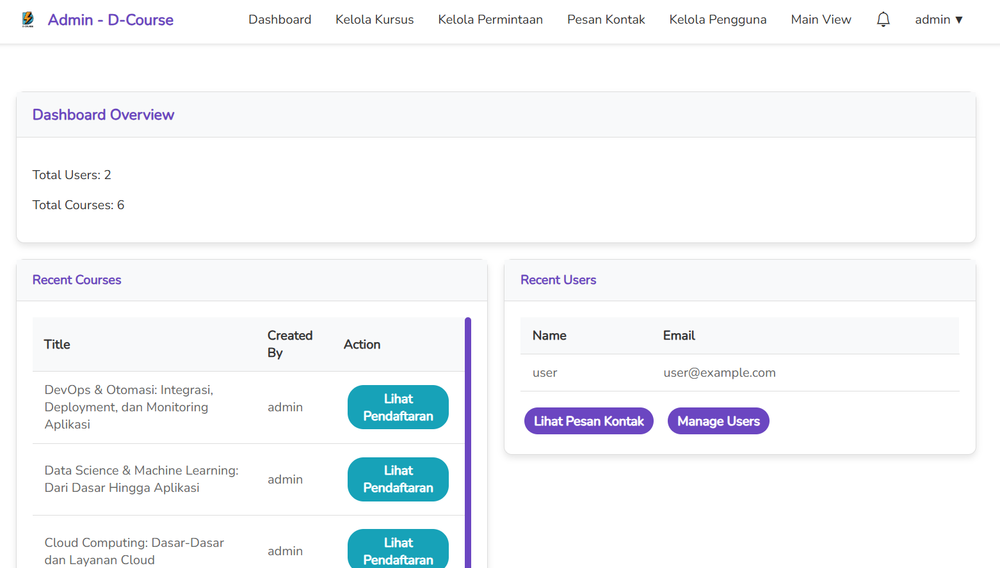

# E-Course - Platform Pembelajaran Online 

E-Course adalah platform pembelajaran online yang dirancang untuk memudahkan pengguna dalam mendaftar dan mengikuti kursus secara daring. Platform ini menyediakan antarmuka yang intuitif untuk pengguna biasa dan administrator, dibangun menggunakan teknologi modern seperti Laravel.

## Fungsi Utama

- **Pendaftaran Kursus**: Pengguna dapat memilih dan mendaftar ke kursus yang tersedia serta mengakses materi pembelajaran.
- **Manajemen Kursus**: Administrator dapat menambah, mengedit, atau menghapus kursus sesuai kebutuhan.
- **Permintaan Pembelian**: Pengguna dapat mengajukan pembelian kursus, yang kemudian akan ditinjau oleh admin untuk persetujuan.
- **Dashboard Admin**: Admin memiliki akses ke dashboard untuk mengelola pengguna, kursus, dan melihat statistik.

## Fitur Utama

- **Autentikasi Pengguna**: Fitur registrasi, login, dan logout untuk keamanan akses.
- **Pencarian Kursus**: Pengguna dapat mencari kursus berdasarkan kata kunci tertentu.
- **Pendaftaran dan Pembatalan**: Pengguna dapat mendaftar atau membatalkan pendaftaran kursus dengan mudah.
- **Permintaan Pembelian**: Sistem pengajuan pembelian kursus dengan proses persetujuan admin.
- **Manajemen Kursus**: Admin dapat mengatur kursus, termasuk menambahkan deskripsi dan thumbnail.
- **Manajemen Pengguna**: Admin dapat melihat dan mengelola daftar pengguna yang terdaftar.
- **Pesan Kontak**: Pengguna dapat mengirim pesan yang akan diterima dan ditanggapi oleh admin.
- **Desain Responsif**: Antarmuka yang ramah pengguna dan dapat diakses di berbagai perangkat.

## Teknologi yang Digunakan

- **Backend**: Laravel 8
- **Frontend**: Blade Templates, CSS Kustom, JavaScript
- **Database**: MySQL
- **Dependensi**: Composer, NPM

## Cara Menjalankan Proyek

Berikut adalah langkah-langkah untuk menjalankan proyek E-Course di komputer lokal Anda:

### Prasyarat

- PHP versi 7.3 atau lebih tinggi
- Composer
- Node.js & NPM
- MySQL

### Langkah-langkah Instalasi

1. **Clone Repository**
   ```bash
   git clone https://github.com/username/e-course.git
   cd e-course

2. **Instal Dependensi PHP**
    ```bash
    composer install

3. **Instal Dependensi JavaScript**
    ```bash
    npm install
    
4. **Konfigurasi Environment**

    Salin file .env.example menjadi .env:
    ```bash
    cp .env.example .env
Buka file .env dan sesuaikan konfigurasi database (nama database, username, password).

5. **Generate Application Key**
    ```bash
    php artisan key:generate

6. **Migrasi Database**
    ```bash
    php artisan migrate

7. **Seed Database (Opsional)**

    Untuk mengisi database dengan data uji:
    ```bash
    php artisan db:seed

8. **Jalankan Server Lokal**
    ```bash
    php artisan serve

9. **Kompilasi Aset**

    Kompilasi CSS dan JavaScript:
    ```bash
    npm i && npm run dev

Akses Aplikasi
    Buka browser dan kunjungi http://localhost:8000.

### Tampilan
